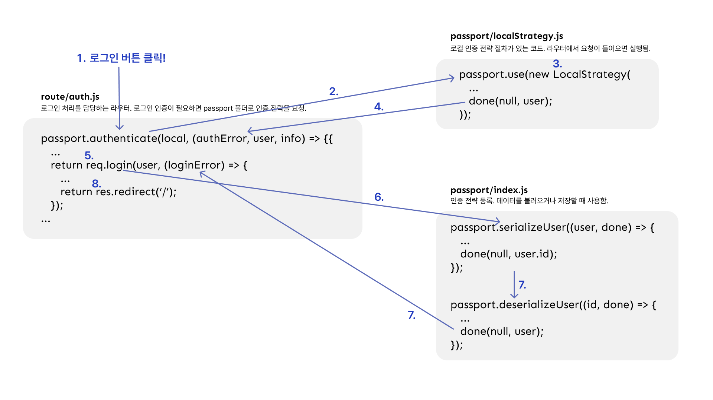

# passport 로그인 과정을 이해해보자

프로젝트에서 로그인 기능을 구현할 때 아이디와 비밀번호로 로그인하는 것뿐만 아니라 소셜 로그인까지 구현하기 위해 passport 라이브러리를 사용하기로 결정했습니다.

이번 글에서는 passport 라이브러리에 대해 알아보고 passport를 통한 로그인 흐름에 대해 알아보고자 합니다.

글을 작성하는 저도 passport를 아직 배우고 있는 중이고 passport 인증 과정이 상당히 복잡하고 까다로워서 아마 이 글을 읽고 이해하기 쉽지 않겠지만 'passport라는 라이브러리의 흐름은 대략 이렇구나~' 정도로만 이해하셔도 좋을 것 같습니다.

## passport란

> _Passport is Express-compatible authentication middleware for Node.js._
>
> [passport github](https://github.com/jaredhanson/passport)

**Passport**는 node.js에서 사용하는 인증 관련 미들웨어입니다.

참고로 미들웨어란 요청을 받고 처리하여 응답을 보내는 과정 중간에서 목적에 맞게 어떠한 처리를 하는 함수들을 의미합니다.

비유하자면, 입출국을 하기 전 여권을 통해 자격이 있는지 인증하는 것처럼 passport 라이브러리도 클라이언트가 서버에 요청할 때 자격이 있는지 인증합니다.

## passport의 인증 전략 종류

Passport는 다양한 인증 전략(strategy)을 제공하는데 크게 로컬 로그인과 소셜 로그인 두 가지로 구분할 수 있습니다.

로컬 전략(passport-local)은 우리가 일반적으로 떠올리는 로그인 방법으로 아이디와 비밀번호를 사용한 인증 방법이고, 소셜 전략(passport-kakao, passport-google-oauth 등)은 Google, Kakao, Naver 등 소셜 네트워크 서비스(SNS)에서 제공하는 로그인 기능을 사용해서 인증하는 방법입니다.

## passport 구조

passport의 폴더 구조를 간단히 정리하면 다음과 같습니다.

- app : passport를 사용한다고 등록
  - `app.use(passport.initialize());` : passport 초기화
  - `app.use(passport.session());` : 로그인 세션을 이용하는 경우 작성
  - passport 폴더의 index 호출 : `passportConfig();`
- passport 폴더 : 로그인 전략 작성
  - `index` : serialize 및 deserialize 작성, strategy 호출
  - `strategy` : local 및 외부 인증 전략 작성
- route 폴더 : '/login' 처리하는 라우터 작성
  - `passport.authenticate` 작성

## 로컬 전략 과정 (passport-local)

> 매우매우 압축적으로 표현해본 인증 흐름
> 

1. 사용자가 로그인 버튼을 눌러 '/login' URL을 호출하면 로그인 요청이 라우터로 들어옵니다.
2. 로그인 요청을 처리하는 미들웨어를 거쳐서 `passport.authenticate()`를 호출합니다.
3. `authenticate()`는 `LocalStrategy`를 호출해서 로그인 전략을 실행합니다.
4. 전략 실행 후 `done()`을 호출하면 다시 `authenticate()`로 이동하여 미들웨어를 진행합니다.
5. `done()`에서 넘겨받은 정보를 토대로 로그인에 성공한 경우 `req.login()`을 호출합니다.
6. `req.login()`가 `passport.serializeUser()`를 호출하고 `done()`을 호출하여 req.session에 user.id를 저장합니다.
7. `passport.deserializeUser()`로 넘어가서 SQL 조회 후 req.user 객체를 등록하고 `done()`을 반환하여 `req.login()`으로 다시 되돌아갑니다.
8. `req.login()`의 미들웨어가 처리되면 `res.redirect('/')`를 응답하여 세션 쿠키를 브라우저에 보냅니다.
9. 로그인 인증 과정을 완료합니다.
10. 로그인 이후 모든 요청에서 `passport.session()` 미들웨어가 `passport.deserializeUser()` 메서드를 호출합니다.

## 소셜 전략 과정

소셜 전략을 구현하기 위해서는 각 사이트의 developers 페이지에서 OAuth 신청을 위한 애플리케이션을 등록하여 key를 받아야 합니다.

소셜 인증의 전체적인 흐름은 `passport-local`과 거의 비슷하지만 각 메서드에서 필요한 인자가 조금씩 다르기 때문에 공식문서에서 어떻게 쓰이는지 확인하고 작성해야 합니다. 또한 소셜 로그인은 로컬과는 달리 회원가입 절차가 없기 때문에 처음 로그인할 때는 회원가입 처리를 하고 두 번째 로그인부터는 로그인 처리를 해야 합니다.
